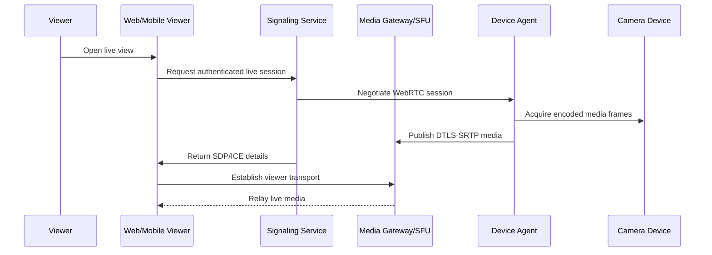

# Livestream Flow

```mermaid
sequenceDiagram
    participant Viewer
    participant WebApp as Web/Mobile Viewer
    participant Signaling as Signaling Service
    participant Gateway as Media Gateway/SFU
    participant Agent as Device Agent
    participant Camera as Camera Device

    Viewer->>WebApp: Open live view
    WebApp->>Signaling: Request authenticated live session
    Signaling->>Agent: Negotiate WebRTC session
    Agent->>Camera: Acquire encoded media frames
    Agent->>Gateway: Publish DTLS-SRTP media
    Signaling->>WebApp: Return SDP/ICE details
    WebApp->>Gateway: Establish viewer transport
    Gateway-->>WebApp: Relay live media
```

Notes:

* Authentication and authorization happen before media is exposed.
* Optional compatibility protocols must not replace this path for primary live viewing.
