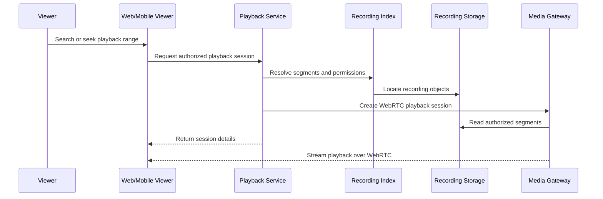

# Playback Flow

```mermaid
sequenceDiagram
    participant Viewer
    participant WebApp as Web/Mobile Viewer
    participant Playback as Playback Service
    participant Index as Recording Index
    participant Storage as Recording Storage
    participant Gateway as Media Gateway

    Viewer->>WebApp: Search or seek playback range
    WebApp->>Playback: Request authorized playback session
    Playback->>Index: Resolve segments and permissions
    Index->>Storage: Locate recording objects
    Playback->>Gateway: Create WebRTC playback session
    Gateway->>Storage: Read authorized segments
    Playback-->>WebApp: Return session details
    Gateway-->>WebApp: Stream playback over WebRTC
```

Notes:

* Playback requests must enforce ownership, retention, and deletion rules.
* Raw storage identifiers should remain internal to services.
